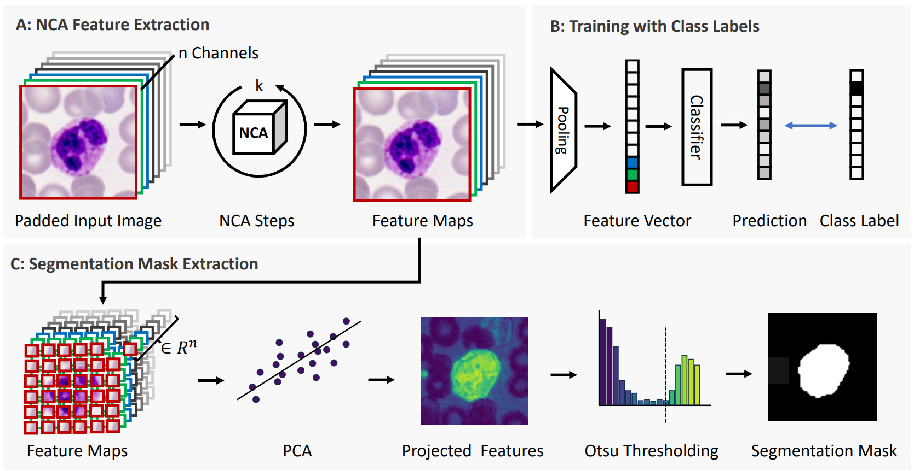

# NCA-WSS: Neural Cellular Automata for Weakly Supervised Segmentation of White Blood Cells

The detection and segmentation of white blood cells in blood smear images is a key step in medical diagnostics, supporting various downstream tasks such as automated blood cell counting, morphological analysis, cell classification, and disease diagnosis and monitoring. Training robust and accurate models requires large amounts of labeled data, which is both time consuming and expensive to acquire. In this work, we propose a novel approach for weakly supervised segmentation using neural cellular automata (NCA-WSS). By leveraging the feature maps generated by NCA during classification, we can extract segmentation masks without the need for retraining with segmentation labels. We evaluate our method on three white blood cell microscopy datasets and demonstrate that NCA-WSS significantly outperforms existing weakly supervised approaches. Our work illustrates the potential of NCA for both classification and segmentation in a weakly supervised framework, providing a scalable and efficient solution for medical image analysis.

[Link to Full Paper](https://arxiv.org/abs/2508.12322)

Contact: michael.deutges@gmail.com

---

## Overview

  

